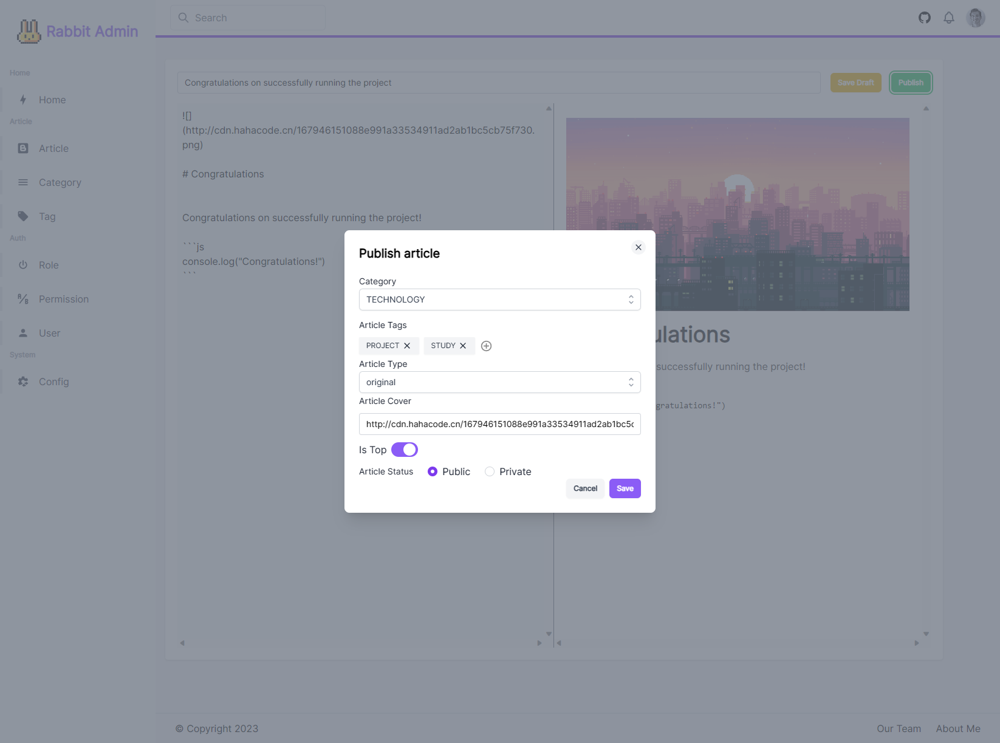

# Rabbit Admin

[English](./README-en.md) | 简体中文

Rabbit Admin 是一个基于 Golang 和 Vue3 的后台管理模板。
 
除了基础技术栈，主要基于作者自己的其他开源项目：
- 前端组件库使用 [unocss-ui](https://github.com/cherryful/unocss-ui)
- 后端框架基于脚手架 [rabbit](https://github.com/szluyu99/rabbit)

> 目前，后端脚手架还不稳定，还在考虑一些模块的设计

## 预览





## 技术栈

前端技术栈：
- [Vue3](https://vuejs.org/) + [Vue Router](https://router.vuejs.org/) + [Pinia](https://pinia.vuejs.org/) + [VueUse](https://vueuse.org/)
- [UnoCSS](https://github.com/unocss/unocss) + [UnoCSS UI](https://github.com/cherryful/unocss-ui) 
- [Eslint](https://eslint.org/) + [@antfu/eslint-config](https://github.com/antfu/eslint-config)，不使用 Prettier

后端技术栈： 
- [Gin](https://gin-gonic.com/) + [Gorm](https://gorm.io/)
- [Rabbit](https://github.com/szluyu99/rabbit)

## 快速开始

```bash
git clone https://github.com/szluyu99/rabbit-admin.git
```


运行后端项目：

```bash
cd rabbit-admin/cmd
```

```bash
# MySQL
# 手动创建数据库 rabbit_admin
go run . -d mysql -n "root:123456@tcp(127.0.0.1:3306)/rabbit_admin?charset=utf8mb4&parseTime=True&loc=Local"

# Sqlite
# 无需其他操作
go run . -d sqlite -n "rabbit_admin.db"
```

> 可以直接运行 `run_mysql.sh` 或 `run_sqlite.sh` 文件

运行起后端项目后，创建一个超级管理员账号：admin@test.com, 123456

```bash
# MySQL
go run . -d mysql -n "root:123456@tcp(127.0.0.1:3306)/rabbit_admin?charset=utf8mb4&parseTime=True&loc=Local" -superuser admin@test.com  -password 123456

# Sqlite
go run . -d sqlite -n "rabbit_admin.db" -superuser admin@test.com  -password 123456
```
> 可以直接运行 `createsuper_mysql.sh` 或 `createsuper_sqlite.sh` 文件

----

运行前端项目：

```bash
cd rabbit-admin/web
```

```bash
npm install -g pnpm
pnpm install
pnpm run dev
```

访问：[http://localhost:5173/](http://localhost:5173/)

## 说明

默认只有超级管理员用户才可以管理权限模块。

使用超级管理员账号登录后，可以在 Role 页面创建角色，然后在 Permission 页面给角色分配权限，最后在 User 页面给用户分配角色（或者在 Config 页面设置创建用户时的默认角色）。

1. 运行项目，并创建一个超级管理员账号，然后登录系统。

2. 进入 Permission 页面，点击初始化按钮，初始化默认权限。

3. 进入 Role 页面，点击初始化按钮，初始化三个默认角色：admin, user, test
- 然后可以给角色分配权限，也可以在 User 页面给用户分配角色

4. 进入 Config 页面，查看项目默认配置
- `USER_NEED_ACTIVATE`: 用户是否需要激活
- `API_NEED_AUTH`: API 是否需要认证, 如果设置为 false，那么所有 API 都不需要认证
- `CREATE_DEFAULT_ROLE`: 创建用户时的默认角色名称, 需要在 Role 中存在

> 如果使用 MySQL，可以直接导入根目录下的 rabbit_admin.sql
> - 超级管理员账号：admin@test.com, 123456
> - 普通用户账号: user@test.com, 123456

5. 退出当前账号，或者打开一个新的浏览器（或无痕浏览），注册一个新账号并登录

6. 新建的账户的默认权限为 user（Config 页面中设置的 `CREATE_DEFAULT_ROLE`）

7. 默认没有给角色分配权限的话，新建的账户只能访问 `Anonymous` 权限的 API